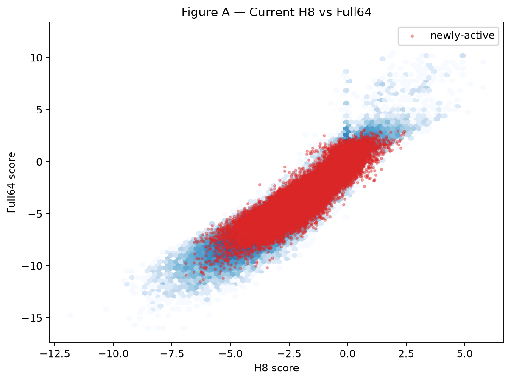
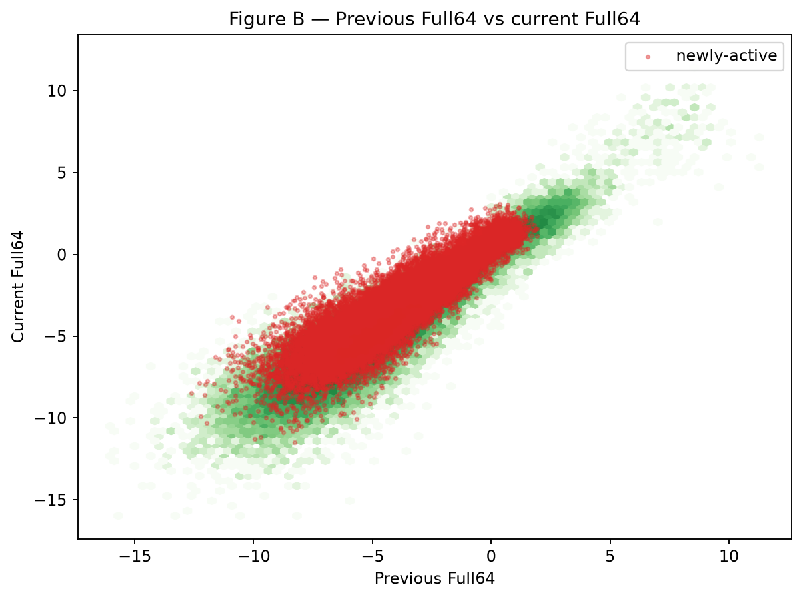
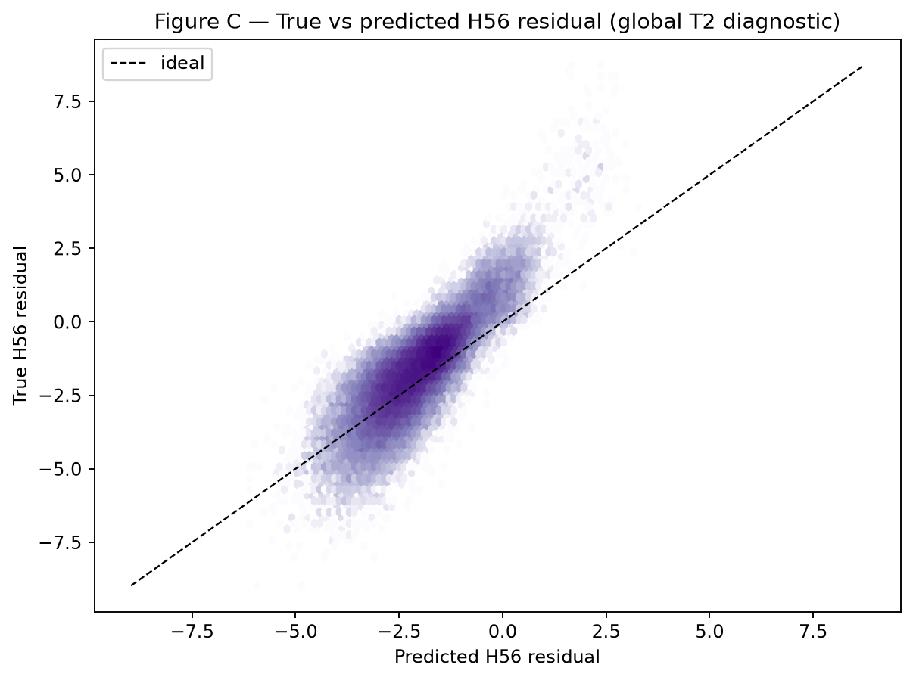
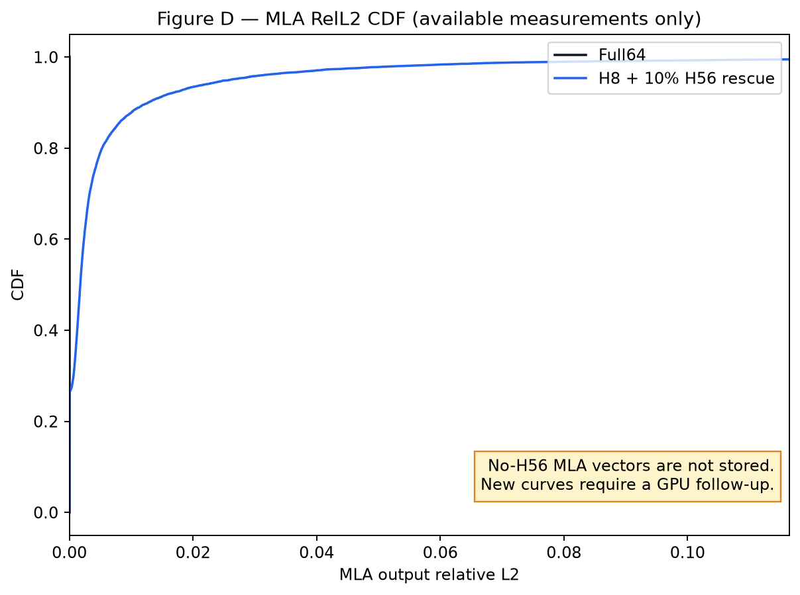
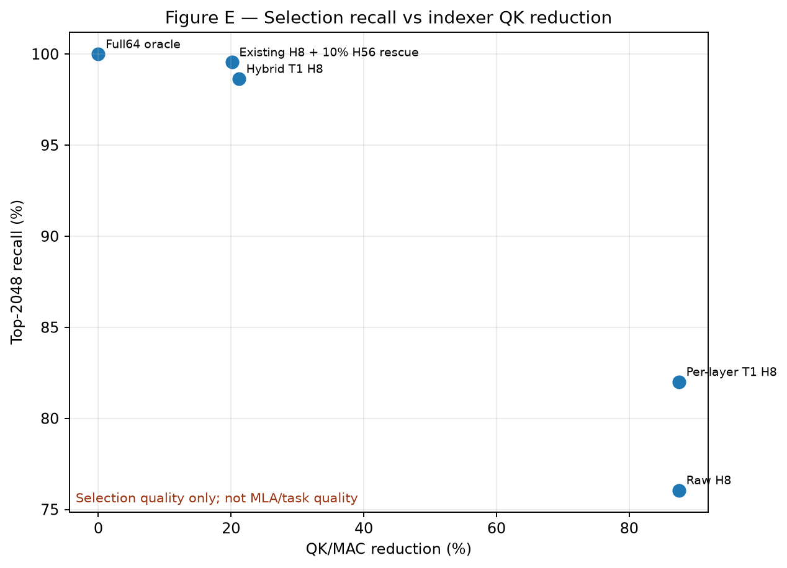

# H8 Full-Score Reconstruction Without H56

## 1. Executive Verdict

**MIXED**

1. **Can H56 be removed entirely?** Not with the tested scalar reconstruction. The validation-selected all-token no-H56 T1 retained only **82.01%** of Full64 Top-2048 on the locked test set.
2. **Best no-H56 reconstruction:** per-layer `T1: a_l * H8_t,s + b_l * Full64_(t-1,s) + c_l`. It improved raw H8 ranking but did not recover the broad Full64 ordering.
3. **Quality lost versus H8 + 10% H56 rescue:** Top-2048 recall fell from **99.555%** to **82.008%** for complete removal. A deployment-style hybrid that keeps temporal-hot Full64 and removes cold-path H56 reached **98.641%**, still 0.915 percentage points lower. New MLA/LM quality is not present in the offline traces.
4. **QK/MAC reduction:** **87.5%** for complete no-H56 reconstruction. The hybrid achieved **21.19%** on the same first-64-step test comparison.
5. **Dominant failure mode:** newly-active temporal-cold tokens and the 32K tail. Hybrid Top-2048 recall falls to 97.20% at 32K; newly-active cold-token recall is only **35.18%**.

Recommendation: **B. Use reconstruction for most blocks, retain a tiny H56 fallback.** Complete H56 removal is not supported; the hybrid result is promising enough for a smaller tail-targeted fallback experiment.

## 2. Dataset / Trace Setup

- Model: `deepseek-ai/DeepSeek-V2-Lite-Chat` research sidecar, revision `85864749cd611b4353ce1decdb286193298f64c7`.
- Full64 score roots: `artifacts/pilot/scores_a/traces`, `artifacts/pilot/scores_b/traces`; calibration: `artifacts/pilot/indexers_1000/traces`.
- Shapes: calibration `(64, 8256)`; heldout `(128, 8320)`, `(128, 16512)`, `(128, 32896)`.
- Layers: 2, 5, 8, 11, 14, 17, 21, 25. Contexts: 8K/16K/32K. B64 and Top-2048 are unchanged.
- Split: 24 locked prior validation traces for calibration; 48 sequence-level validation traces (`code_heldout_4`, `text_heldout_27454`); 96 final test traces from the remaining four heldout sequences.
- Fit observations: 12,434,688 token pairs. Final comparison uses the first 64 transitions because the locked global-budget H8+10% H56 baseline stores 64 transitions.
- H8 was reconstructed from existing hidden captures and frozen sidecar checkpoints on CPU. A 16-row Full64 numerical audit gave Pearson >0.999988 and Top-2048 recall 99.71–99.90% versus the stored GPU trace, quantifying CPU/GPU BF16 variation.
- No model forward, CUDA kernel, or new GPU inference was run.

## 3. Correlation and Residual Structure

Across 233,826,304 valid test observations:

- H8 vs Full64 Pearson/Spearman: **0.8912 / 0.9190**.
- previous Full64 vs current Full64: **0.8520 / 0.8943**.
- H8 vs true H56 residual: **0.4938 / 0.6141**.
- previous Full64 vs current H56 residual: **0.7323 / 0.7918**.
- In temporal-cold regions, H8 vs H56 residual Pearson falls to **0.3634**, while previous Full64 vs residual is **0.6491**.

The omitted residual has global mean/std -2.142/1.305. For newly-active tokens its sampled p95/p99/p99.9 are 0.541/1.478/2.351. The residual is correlated enough to improve ranking but not predictable enough for a tail-safe scalar replacement.







## 4. Main Reconstruction Results

| Method | H56 computed? | QK reduction | Top-2048 recall | Top-128 recall | Top-512 recall | RelL2 p95 | RelL2 p99 | KL mean | PPL Δ |
| --- | ---: | ---: | ---: | ---: | ---: | ---: | ---: | ---: | ---: |
| Full64 oracle | all 64 heads | 0% | 100% | 100% | 100% | 0% | 0% | 0 | 0% |
| Existing H8 + 10% H56 rescue | cold rescue | 20.13% | 99.555% | 99.9953% | 99.9636% | 2.60% | 8.02% | 0.002593 | -0.495% |
| Raw H8, all tokens | no | 87.5% | 76.06% | 99.59% | 97.46% | GPU follow-up | GPU follow-up | GPU follow-up | GPU follow-up |
| Previous Full64 only | no | 100% current QK | 72.97% | 98.18% | 95.08% | GPU follow-up | GPU follow-up | GPU follow-up | GPU follow-up |
| Per-layer affine H8 | no | 87.5% | 76.06% | 99.59% | 97.46% | GPU follow-up | GPU follow-up | GPU follow-up | GPU follow-up |
| Per-layer T1 | no | 87.5% | 82.01% | 99.94% | 99.39% | GPU follow-up | GPU follow-up | GPU follow-up | GPU follow-up |
| Hybrid T1 | cold only | 21.19% | 98.64% | 99.98% | 99.87% | GPU follow-up | GPU follow-up | GPU follow-up | GPU follow-up |

Positive affine rescaling does not change ranking when the whole score population is H8-derived; raw/global/per-layer/mass-normalized H8 therefore have identical pure Top-K sets. Affine calibration matters only when reconstructed cold scores compete with temporal-hot Full64 scores.

Validation selected these per-layer T1 coefficients, with no test fitting:

| Layer | a (H8) | b (previous Full64) | c |
| ---: | ---: | ---: | ---: |
| 2 | 0.962397 | 0.403136 | -0.169128 |
| 5 | 0.862342 | 0.357537 | -0.692992 |
| 8 | 1.044469 | 0.264294 | -1.083999 |
| 11 | 0.935273 | 0.296524 | -0.582515 |
| 14 | 0.964423 | 0.332374 | -0.698156 |
| 17 | 1.066011 | 0.372062 | -0.523292 |
| 21 | 1.208640 | 0.256790 | -0.344789 |
| 25 | 0.985097 | 0.283066 | -1.264207 |

## 5. Newly-Active Failure Analysis

- Test newly-active observations: **6,691,323 token occurrences** across **1,671,431 B64 block occurrences**.
- Hybrid T1 newly-active recall: **96.56%** overall, but **35.18%** for the 248,352 occurrences that remained temporal-cold.
- Hybrid false-negative rate across newly-active tokens: **3.44%**; worst missed Full64 threshold margin: **3.2158**.
- Cold-population rank p50/p95 for newly-active cold tokens: **24 / 734.3**.
- The diagnostic `small H8 + top-decile H56 residual` condition occurred 88 times. Most were rescued by temporal-hot treatment, which explains why complete H56 removal degrades more severely than hybrid removal.

## 6. Cost / Metadata Analysis

- Full64 indexer work: `64*128 = 8192` head-dimension MACs per KV token; H8: `8*128 = 1024`, a theoretical **87.5% QK/MAC reduction**.
- T1 reconstruction adds roughly five scalar FLOPs per token (`a*h8 + b*prev + c`).
- H8 still reads the shared 128-D K vector. At BF16 this is **256 bytes/token**, so no physical K-byte reduction is claimed.
- Previous-score metadata is 4 bytes/token in FP32 or 2 bytes/token in FP16/BF16/INT16. Relative to a 256-byte BF16 indexer K it is 1.5625% or 0.78125% per layer.
- At 128K, previous-score state is 512 KiB/layer in FP32 and 256 KiB/layer in FP16; across eight evaluated layers this is 4 MiB or 2 MiB.

## 7. Comparison to Existing H8 + 10% Rescue

The locked global-budget rescue baseline keeps Top-2048 recall at 99.555% with median QK reduction 20.13% and measured MLA RelL2 p95/p99 2.60%/8.02%. Complete no-H56 T1 gains another 67.37 percentage points of theoretical QK reduction but loses 17.55 recall points. Hybrid T1 gains 1.06 QK-reduction points and loses 0.915 recall points.

The new sparse selections require the main-attention V tensors/projection and model logits, which are not stored in the offline score trace. Therefore:

- **OFFLINE TRACE RESULT:** all correlation, Top-K, newly-active, attention-mass proxy, cost, and split-controlled regression results in this report.
- **GPU FOLLOW-UP REQUIRED:** new-policy MLA RelL2/cosine, logit KL, and PPL. No GPU work was launched automatically.





## 8. Recommendation

### B. Use reconstruction for most blocks, retain tiny H56 fallback

Do not replace all current-step H56 with scalar reconstruction. The next experiment should keep T1 for ordinary cold blocks and invoke H56 only for a validation-calibrated tail trigger targeting newly-active cold tokens near the Top-2048 boundary. A useful target is below 1–2% of cold blocks, followed by the deferred MLA and LM-quality replay.

```text
Best no-H56 policy: Per-layer T1 reconstruction
Formula: I_hat[t,s] = a_l * H8[t,s] + b_l * Full64[t-1,s] + c_l
Calibration parameters: 8 per-layer (a,b,c) tuples in calibration_parameters.csv
QK reduction: 87.5%
Top-2048 recall: 82.008%
Top-128 recall: 99.940%
Top-512 recall: 99.385%
MLA RelL2 p95 / p99: GPU FOLLOW-UP REQUIRED
Logit KL: GPU FOLLOW-UP REQUIRED
PPL delta: GPU FOLLOW-UP REQUIRED

vs H8 + 10% H56 rescue:
Quality change: Top-2048 recall -17.548 percentage points; MLA/LM change pending
Compute change: QK reduction 20.13% -> 87.5%
Metadata change: add one previous-score scalar per KV token/layer (2 or 4 bytes)

Main remaining failure: newly-active temporal-cold tokens, especially at 32K
Recommended next experiment: per-layer T1 plus <1–2% validation-fixed tail H56 fallback, then MLA/KL/PPL replay
```
