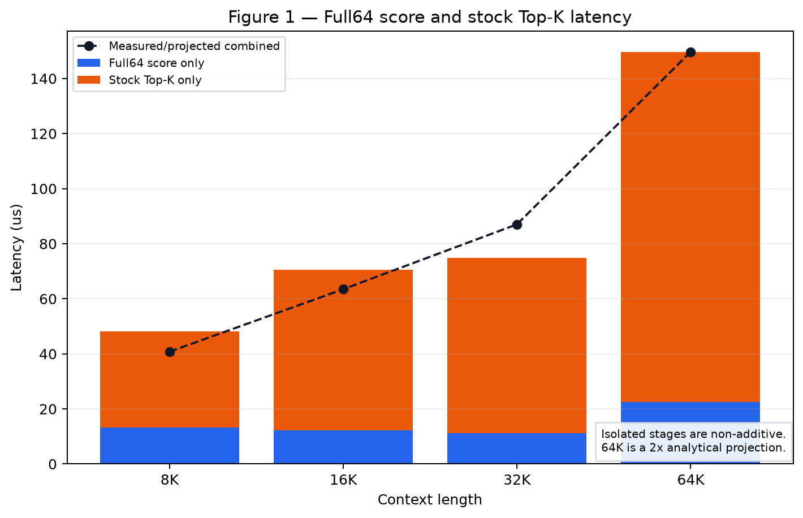
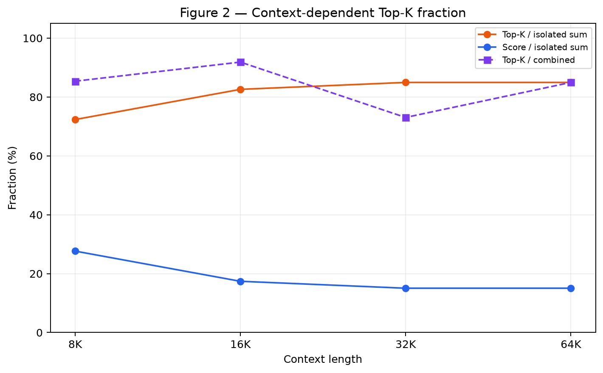
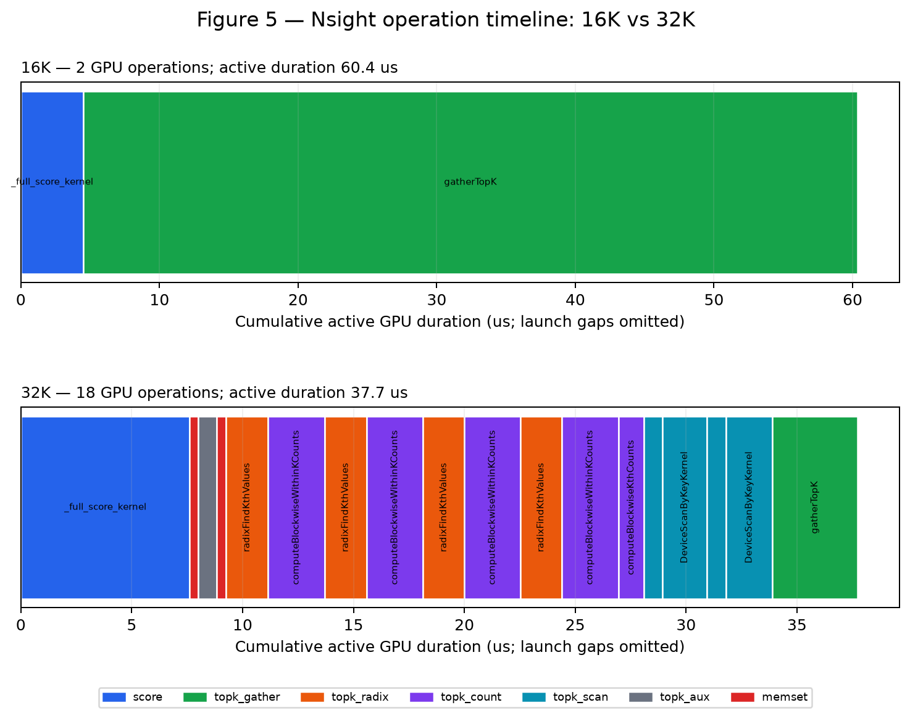
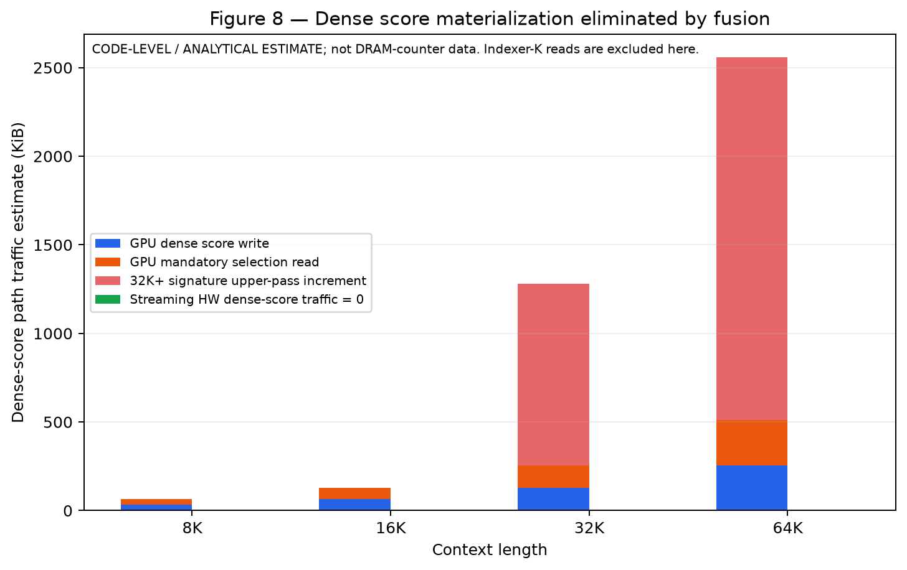
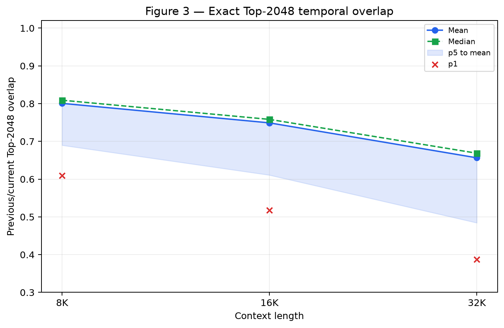
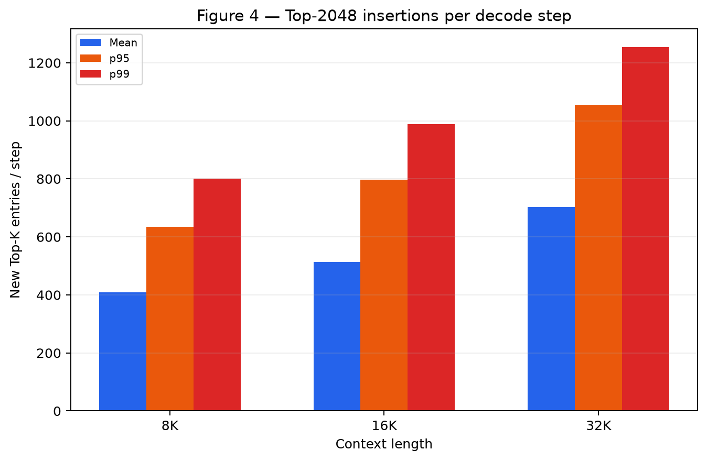
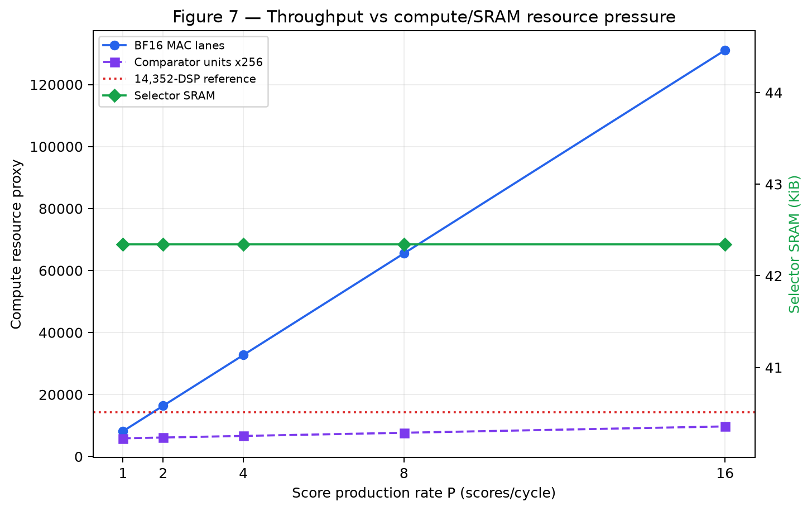
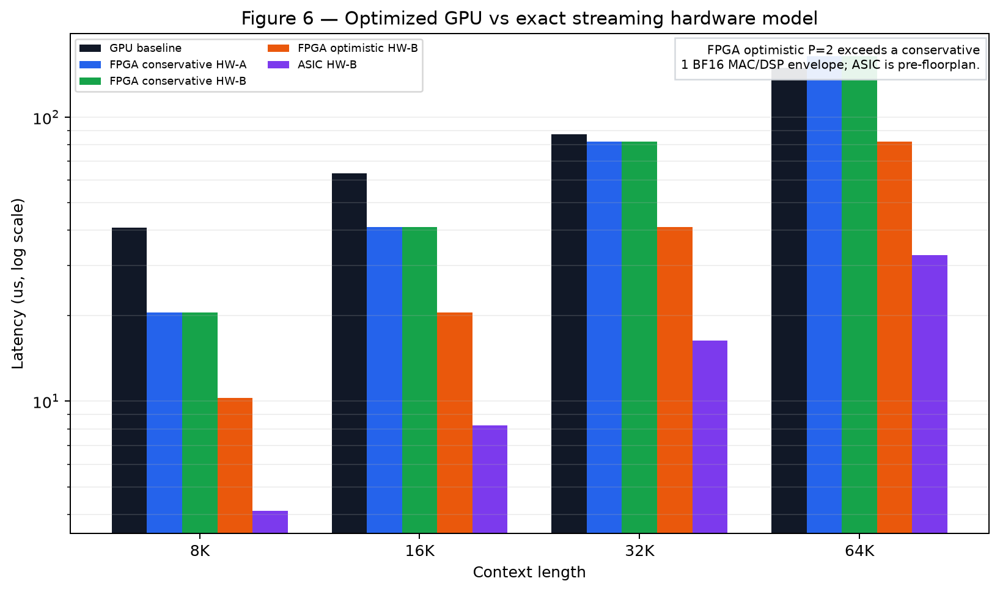

# DSA Streaming Top-K Hardware Feasibility

## 1. Executive Verdict

**Verdict: PROMISING. Final recommendation: BUILD MORE DETAILED CYCLE MODEL FIRST.**

This verdict is for a DSA-specific, fused Full64-score + exact Top-2048 stream, not for a stand-alone sorting accelerator and not for the approximate H8 path. The evidence supports continued architecture work, but it does not yet support RTL sign-off.

1. **Does the bottleneck change with context?** The GPU dispatch changes sharply at 32K, and the normalized isolated-stage Top-K share rises from 72.3% at 8K to 85.0% at 32K. However, there is no measured score-to-Top-K crossover: stock Top-K is already the larger isolated stage at 8K.
2. **Where does Top-K become dominant?** At or below the smallest measured point, 8K. At 32K, Top-K-only time is 73.1% of the measured combined latency; isolated stages are non-additive.
3. **Why are there 18 GPU operations at 32K?** Nsight resolves them as 1 Full64 scorer kernel, 15 Top-K CUDA kernels, and 2 CUDA memsets. The Top-K path uses workspace initialization, four radix threshold-refinement passes, four within-K count passes, a Kth-count pass, two scan initializations, two scans, and a final gather. They are not 18 sorting kernels.
4. **Can exact streaming Top-K remove the bottleneck?** Architecturally yes: it eliminates dense score materialization and overlaps selection with score production. Quantitatively, the conservative FPGA point reaches only 1.062x at 32K and 0.914x at projected 64K, while a P=2 FPGA point reaches 2.124x but exceeds a conservative one-BF16-MAC-per-DSP envelope. The pre-floorplan ASIC point is 5.309x/4.567x at 32K/64K. This is promising, not proven.
5. **Does previous Top-K warm-start help?** Yes for activity: exact heap admissions fall by 70.5% on average at 32K, with exact-match rate 1.0 over all 18,288 transitions. It does not reduce the mandatory N-score scan and therefore does not improve the modeled P=1 scorer-bound latency.
6. **FPGA Top-K-only offload?** NO-GO. PCIe payload and round-trip latency are not consistently faster than the GPU Top-K, retain dense score materialization, and add two synchronization boundaries.
7. **Fused Indexer+TopK hardware?** Worth a detailed model for ASIC and possibly a more favorable FPGA DSP packing study. Conservative FPGA mapping is not yet an RTL GO.
8. **Start RTL now?** No. First close the heap hazard, banking, DSP packing, timing, HBM scheduling, and power/floorplan uncertainties in a more detailed cycle model.

Primary evidence uses 144 real Full64 score traces (6 sequences x 3 contexts x 8 layers, 128 steps each) and the optimized Triton scorer plus stock `torch.topk(K=2048)`. The 64K values are explicitly analytical because no real 64K sidecar capture exists. No 128K timing was generated: there is no real 128K trace and expensive new model inference was outside this pilot. These DeepSeek-V2-Lite sidecar results must not be presented as production DeepSeek-V3.2 measurements.

## 2. GPU Bottleneck Characterization

### Repository and evidence audit

| Item | Exact location / finding |
|---|---|
| Full64 Lightning Indexer | `src/temporal_dsa/progressive_kernel.py`: `_full_score_kernel`, `full_scores_triton` |
| Current Top-K | `scripts/benchmark_progressive_dsa.py`: `torch.topk(..., sorted=False)` in `launch_full` |
| Timing harnesses | `scripts/benchmark_progressive_dsa.py`, `scripts/benchmark_progressive_stages.py`, and new `scripts/benchmark_full64_topk_decomposition.py` |
| Nsight harness/parser | `scripts/profile_progressive_dsa.py`, `scripts/summarize_progressive_nsight.py`, new `scripts/extract_full64_topk_nsight.py` |
| Full64 traces | `artifacts/pilot/scores_a/traces`, `artifacts/pilot/scores_b/traces`; inventory in `artifacts/h8_reconstruction/final/trace_inventory.csv` |
| Prior H8/temporal artifacts | `artifacts/progressive_sw/final`, `artifacts/h8_reconstruction/final`, `artifacts/fused_h8_sm89/run_20260826_sm89` |
| Context dispatch | No repository-level custom branch was found around `torch.topk`; the 16K/32K divergence occurs inside the ATen/CUDA implementation selected for shape K=2048 |

### Locked bottleneck decomposition

| Context | Full64 score only (us) | Top-K only (us) | Combined (us) | Score fraction* | Top-K fraction* | GPU ops | Status |
|---:|---:|---:|---:|---:|---:|---:|---|
| 8K | 13.312 | 34.816 | 40.784 | 27.7% | 72.3% | 2 | LOCKED CUDA-EVENT MEASUREMENT |
| 16K | 12.288 | 58.320 | 63.488 | 17.4% | 82.6% | 2 | LOCKED CUDA-EVENT MEASUREMENT |
| 32K | 11.264 | 63.584 | 87.040 | 15.0% | 85.0% | 18 | LOCKED CUDA-EVENT MEASUREMENT |
| 64K | 22.528 | 127.168 | 149.696 | 15.0% | 85.0% | n/a | ANALYTICAL 2X PROJECTION FROM 32K; NO REAL 64K TRACE |

\* Fractions are normalized over `T_score + T_topk` so the two columns sum to 100%. Independent CUDA-event stage measurements are not additive: cache state, allocator/workspace behavior, launch scheduling, and measurement boundaries differ. Relative to measured combined latency, Top-K is 85.4%, 91.9%, and 73.1% at 8K, 16K, and 32K. The 32K 73.1% observation is preserved, but it must not be combined with the normalized table fractions.

The same scorer and stock Top-K were rerun twice on the currently free L40S device with three real captures per context, 100 warmups, 1,000 measurements, and a 64 MiB cache flush. Score-only ranges were 21.50–22.82 us at 8K, 22.62–23.68 us at 16K, and 22.62–24.61 us at 32K; combined ranges were 56.32, 63.49, and 101.38–103.09 us. This repeat audit is retained in `gpu_decomposition_repeat_audit.csv`, while the locked baseline remains the performance reference for continuity. The protocol sensitivity is a weakness, not silently averaged away.





### Exact 16K and 32K operation path

At 16K the first profiled iteration consists of `_full_score_kernel` (4.512 us) followed by `gatherTopK` (55.840 us). At 32K, the first iteration is:

| # | Type | Stage | Operation | Duration (us) |
|---:|---|---|---|---:|
| 1 | kernel | Full64 score | `_full_score_kernel` | 7.616 |
| 2 | memset | Top-K workspace memset | `cudaMemset` | 0.384 |
| 3 | kernel | initialize Top-K workspace | `fill` | 0.832 |
| 4 | memset | Top-K workspace memset | `cudaMemset` | 0.416 |
| 5 | kernel | radix threshold refinement | `radixFindKthValues` | 1.888 |
| 6 | kernel | blockwise within-K count | `computeBlockwiseWithinKCounts` | 2.560 |
| 7 | kernel | radix threshold refinement | `radixFindKthValues` | 1.888 |
| 8 | kernel | blockwise within-K count | `computeBlockwiseWithinKCounts` | 2.560 |
| 9 | kernel | radix threshold refinement | `radixFindKthValues` | 1.856 |
| 10 | kernel | blockwise within-K count | `computeBlockwiseWithinKCounts` | 2.528 |
| 11 | kernel | radix threshold refinement | `radixFindKthValues` | 1.856 |
| 12 | kernel | blockwise within-K count | `computeBlockwiseWithinKCounts` | 2.560 |
| 13 | kernel | blockwise Kth count | `computeBlockwiseKthCounts` | 1.152 |
| 14 | kernel | scan-by-key initialization | `DeviceScanByKeyInitKernel` | 0.832 |
| 15 | kernel | scan-by-key | `DeviceScanByKeyKernel` | 2.016 |
| 16 | kernel | scan-by-key initialization | `DeviceScanByKeyInitKernel` | 0.864 |
| 17 | kernel | scan-by-key | `DeviceScanByKeyKernel` | 2.080 |
| 18 | kernel | final Top-K gather | `gatherTopK` | 3.840 |

The aggregated 32K Top-K kernel+memset active duration is about 30.2 us, whereas the Nsight NVTX wall interval is 140.66 us and the locked CUDA-event combined result is 87.04 us. These are different protocols: the active sum excludes launch gaps and CPU scheduling; NVTX includes them; CUDA events use the locked benchmark boundary. No memcpy was recorded in the profiled range.



PyTorch's CUDA radix-selection source describes iterative bit refinement and explicitly notes as many as 16 float32 passes in the generic routine; the observed shape-specific path uses four refinement rounds plus count/scan/gather machinery. This explains the GPU synchronization structure without calling it a full sort: https://github.com/pytorch/pytorch/blob/main/aten/src/ATen/native/cuda/SortingRadixSelect.cuh

### Data movement

`ncu` was unavailable on the L40S server, so every byte count below is **CODE-LEVEL / ANALYTICAL ESTIMATE**, not measured DRAM traffic. The lower bound includes one dense score write and one selection read. For the 32K signature upper estimate, four radix, four within-K-count, and one gather score pass are counted; partial accesses and workspace traffic make this a signature-based bound, not a counter result.

| Context | GPU dense write | GPU select read lower / upper | Score passes lower / signature upper | GPU final result | HW dense-score traffic | HW final IDs |
|---:|---:|---:|---:|---:|---:|---:|
| 8K | 32 KiB | 32 / 32 KiB | 1 / 1 | 24 KiB | 0 B | 8 KiB |
| 16K | 64 KiB | 64 / 64 KiB | 1 / 1 | 24 KiB | 0 B | 8 KiB |
| 32K | 128 KiB | 128 / 1152 KiB | 1 / 9 | 24 KiB | 0 B | 8 KiB |
| 64K | 256 KiB | 256 / 2304 KiB | 1 / 9 | 24 KiB | 0 B | 8 KiB |

At 32K, eliminating the score materialization/select traffic cuts the modeled total off-chip bytes by 3.2% under the mandatory lower bound and 13.6% under the multi-pass signature upper estimate. The percentage is modest because the unavoidable BF16 indexer-K stream is 8 MiB per layer and dominates total bytes. Dense-score traffic itself is eliminated 100%.

Input token IDs are implicit array indices until the final gather. The GPU output is 2,048 FP32 values plus 2,048 INT64 indices (24 KiB); the hardware interface returns only 2,048 INT32 IDs (8 KiB) because scores remain internal. Nsight exposes the 32K 4-byte and 128-byte workspace memsets and the fill/count/scan kernels, but not a reliable total intermediate allocation or DRAM byte count. Intermediate workspace traffic is therefore listed as unknown rather than fabricated.



## 3. Top-K Temporal Churn

All 18,288 adjacent-step transitions were replayed from the real Full64 scalar traces using stable exact Top-2048 sets.

| Context | Transitions | Overlap mean | Median | p5 | p1 | New mean | p95 | p99 | Max |
|---:|---:|---:|---:|---:|---:|---:|---:|---:|---:|
| 8K | 6,096 | 80.1% | 80.9% | 69.0% | 60.9% | 408.1 | 635.2 | 800.1 | 1082 |
| 16K | 6,096 | 74.9% | 75.8% | 61.1% | 51.8% | 513.9 | 797.0 | 988.1 | 1374 |
| 32K | 6,096 | 65.7% | 66.9% | 48.4% | 38.8% | 703.4 | 1056.0 | 1254.1 | 1492 |

Overlap declines materially with context. At 32K, layer 17 is worst (62.0% mean overlap) and layer 2 is best (69.5%). Early/middle/late differences are small: 65.4%, 65.5%, and 66.1% mean overlap, so decode phase alone does not yield an easy exact shortcut.





The previous-rank tail is decisive. Among 32K entries newly entering current Top-2048: 12.31% came from ranks 2049–2304, 50.35% from 2305–4096, 29.56% from 4097–8192, 6.89% from 8193–16384, 0.75% from 16385+, and 0.14% were newly appended tokens without a prior rank. Thus 37.20% came from beyond rank 4096 and 7.64% from beyond rank 8192 or were new. A small neighborhood around previous Top-K cannot be exact.

Using the previous threshold as a hard discard would have missed 3,216,180 current-TopK occurrences across the replay. Previous state is therefore an ordering and initialization hint only.

## 4. Exact Streaming Top-K Architecture

The fused datapath is: BF16 indexer-K stream -> Full64 MAC/reduction -> scalar score -> threshold comparator -> candidate FIFO -> banked exact min-heap/candidate manager -> final Top-2048 ID SRAM. The N scalar scores are never written to off-chip memory. Score production and selection overlap, giving `T_fused ~= max(T_score_hw, T_topk_hw) + T_drain` rather than the GPU's serialized `T_score + T_topk`.

### Rejected exact baseline: chunk-local Top-r + merge

Architecture-A sweeps B={32,64,128,256} and r={8,16,32,64}. Because K=2048 exceeds every chunk size, an arbitrary chunk may contribute all B items to the global Top-2048. Worst-case exactness therefore requires r>=B. Every r<B point is explicitly **APPROXIMATE**; exact points retain every item and offer no candidate reduction. A naive 2048-way insertion network is also rejected because its 2048 comparisons per arriving score are not area/timing credible.

The CSV contains 64 sweep rows, of which 12 are exact only by retaining the entire chunk. The primary exact model instead uses a threshold-guided, pipelined K-entry min-heap with 11 logical heap levels, candidate FIFO, and banked SRAM.

### Cycle/event model

The simulator sweeps P={1,2,4,8,16} scores/cycle, admission lanes={1,2,4}, SRAM banks={2,4,8}, 250/400/500/1000 MHz, and 256/512/1024/2048 GB/s. Compute cycles are `ceil(N/P)`; K-stream memory cycles are `ceil(256N/BW * f)`; admission cycles use trace-measured mean admissions divided by effective lanes; drain uses the p99 FIFO depth plus 11 heap levels. The selector must accept every score; warm start never skips scoring.

The crucial model assumption is one admitted candidate per cycle per lane in a pipelined heap. Same-address SRAM hazards, threshold feedback latency, multi-bank arbitration, tie handling, and worst-case burst admission are not RTL-validated. This is the main reason to build a deeper cycle model before RTL.

## 5. Previous-TopK Warm-Start Architecture

HW-B seeds the exact K-entry state with current scores of the previous exact Top-2048 IDs, then streams every remaining current score. The previous Kth threshold orders work but is never used as a correctness certificate. The final stable Top-2048 set matched the reference on every replayed transition.

| Context | Cold admissions mean | Warm admissions mean | Mean reduction | Warm p95 | Warm p99 | Warm max | Exact match |
|---:|---:|---:|---:|---:|---:|---:|---:|
| 8K | 3943.9 | 740.8 | 80.9% | 1201 | 1631 | 2642 | 1.000 |
| 16K | 2883.8 | 947.9 | 66.4% | 1530 | 1993 | 3010 | 1.000 |
| 32K | 4834.2 | 1401.9 | 70.5% | 2255 | 2863 | 4601 | 1.000 |

At 32K, warm-start admissions fall from 4,834 to 1,402 on average. At P=16 and four admission lanes the modeled p99 residual FIFO depth is 468 entries (about 3.7 KiB at 8 bytes/entry), versus 2,593 cold. This reduces candidate SRAM writes, merges, and switching activity. It does not change the N/P streaming floor, so cold and warm have identical latency at scorer- or memory-bound selected points.

Conceptually this resembles temporal warm-start in GVR, but the proposed hardware differs in where it acts: GVR predicts/refines a threshold on a GPU and finishes with exact shared-memory selection, whereas HW-B uses previous state to initialize an always-on fused score/selection pipeline. GVR reports 1–2 global threshold passes followed by exact verification/final selection: https://arxiv.org/abs/2604.22312 and https://github.com/NVIDIA/TensorRT-LLM/blob/main/docs/source/blogs/tech_blog/blog21_Temporal_Correlation_Meets_Sparse_Attention.md

## 6. FPGA Feasibility

The reference envelope is a generic modern high-end FPGA, not a claim about one exact SKU. AMD's Versal Premium selection guide lists a high-end envelope up to 14,352 DSPs, 174 Mb BRAM, and 717 Mb URAM; VP1902 itself lists 6,864 DSPs, so the numerical model must not be labeled a VP1902 implementation. Sources: https://docs.amd.com/api/khub/documents/4V3OO2hrA~S52y3qLcexSw/content and https://www.amd.com/content/dam/amd/en/documents/products/adaptive-socs-and-fpgas/versal/2118851-versal-premium-vp1902-product-brief.pdf

| FPGA point | P | Admission lanes | Clock | K bandwidth | 32K latency | 32K speedup | 64K latency | 64K speedup | BF16 MAC lanes | DSP fraction* | Selector SRAM |
|---|---:|---:|---:|---:|---:|---:|---:|---:|---:|---:|---:|
| FPGA conservative HW-A | 1 | 1 | 400 MHz | 256 GB/s | 81.948 us | 1.062x | 163.868 us | 0.914x | 8,192 | 57.1% | 34.2 KiB |
| FPGA conservative HW-B | 1 | 1 | 400 MHz | 256 GB/s | 81.948 us | 1.062x | 163.868 us | 0.914x | 8,192 | 57.1% | 42.2 KiB |
| FPGA optimistic HW-B | 2 | 2 | 400 MHz | 512 GB/s | 40.987 us | 2.124x | 81.948 us | 1.827x | 16,384 | 114.2% | 42.3 KiB |

\* Conservative accounting assumes one BF16 MAC lane per DSP. P=2 needs 16,384 lanes, or 114.2% of the 14,352-DSP envelope, so the attractive optimistic point is resource-infeasible under that mapping. Packing two BF16 MACs per DSP or using LUT arithmetic could change the conclusion, but neither is claimed without synthesis. P=1 consumes 8,192 MAC lanes (57.1%) and is resource-plausible, yet its modeled speedup is weak and becomes <1x against the projected 64K GPU baseline.

Selector state itself is modest: 16 KiB theoretical FP32+INT32 Top-2048, 32 KiB double-buffered heap, 8 KiB previous IDs, FIFO/pipeline scratch, and about 43 KiB in the selected warm model. Provision 64–96 KiB for ECC, banking, metadata, and burst margin. The dominant challenge is Full64 MAC density and K-stream bandwidth, not Top-K SRAM.

At 64–96 KiB (0.52–0.79 Mb), selector storage is below 0.5% of the cited 174 Mb BRAM envelope and can be split across BRAM/URAM banks. The simplified P=1 selector count is 12 comparator units (one stream threshold plus 11 heap levels); the P=2 point uses 24. This is a logical count, not a LUT estimate—LUT use, fanout, and 400 MHz closure require synthesis.

**FPGA decision: Top-K-only NO-GO; fused Indexer+TopK NO-GO for immediate RTL under conservative one-MAC/DSP mapping. Continue only with a DSP-packing/HBM-aware detailed model.**



## 7. ASIC Feasibility

The abstract ASIC point uses P=2, two admission lanes, four SRAM banks, 1 GHz, and 1,024 GB/s local/HBM bandwidth. It needs 16,384 BF16 MAC lanes, 24 threshold/heap comparator units in the simplified count, and about 43.4 KiB selector SRAM. The model predicts 16.395 us at 32K (5.309x) and 32.779 us at projected 64K (4.567x). Cold and warm latency are equal because score streaming dominates; warm start remains valuable as an activity/energy optimization.

This is not an area, power, timing, or floorplan result. A credible ASIC next model must include MAC-tree wiring, ReLU/head weighting, K-tile buffering, HBM command efficiency, heap feedback timing, bank conflicts, clock crossings, output ordering, and sparse-MLA handoff. **Decision: GO for floorplan-quality cycle/area/power modeling, not RTL sign-off.**



## 8. PCIe Offload Analysis

The naive GPU-score -> PCIe -> FPGA-TopK -> PCIe -> GPU path transfers 40, 72, 136, and 264 KiB at 8K/16K/32K/64K. The model uses effective 25 GB/s Gen4 x16 or 50 GB/s Gen5 x16, fixed round trips of 20/40/80 us, and a generous P=16, 400 MHz selector.

| Context | Payload | Gen4 40-us total / speedup | Gen5 40-us total / speedup |
|---:|---:|---:|---:|
| 8K | 40 KiB | 42.92 us / 0.81x | 42.10 us / 0.83x |
| 16K | 72 KiB | 45.51 us / 1.28x | 44.03 us / 1.32x |
| 32K | 136 KiB | 50.69 us / 1.25x | 47.91 us / 1.33x |
| 64K | 264 KiB | 61.05 us / 2.08x | 55.65 us / 2.29x |

Some optimistic long-context points exceed 1x, but the result is not consistent across contexts and 64K uses a projected GPU baseline. More importantly, the design preserves the GPU dense-score write, introduces transport in both directions, and requires two cross-device synchronization points per layer. **TOP-K-ONLY FPGA OFFLOAD = NO-GO.**

## 9. Comparison with Current H8 Progressive Software

The locked 32K result remains: optimized Full64 + stock Top-K = 87.04 us; fused progressive H8 + stock Top-K = 104.61 us; speedup = 0.832x. At this context the stock Top-K itself is 63.584 us and dispatches the same 17-operation Top-K subpath. Reducing QK work did not eliminate selection, and the H8 kernel added temporal masking, head reduction/control, and less regular work. The measured result therefore invalidates a simple 'fewer MACs means faster' argument.

The dedicated fused architecture changes the question: it removes the serialized dense-score/stock-TopK boundary and overlaps exact selection with Full64 scoring. The old analytical 1.571x ceiling is not used as measured performance anywhere in this report.

## 10. Secondary Temporal+H8 Incremental Extension

This section is explicitly **APPROXIMATE** and is not part of the exact accelerator GO decision.

| Approximate method | Candidate fraction | QK reduction | Top-128 | Top-512 | Top-2048 | New-active recall | MLA RelL2 p95 / p99 | PPL delta |
|---|---:|---:|---:|---:|---:|---:|---:|---:|
| Temporal progressive H8 r0.1 | 80.9% | 14.0% | 99.998% | 99.970% | 99.588% | 54.9% | 0.0261 / 0.0918 | -0.0044 |
| Existing H8 + 10% H56 rescue | n/a | 20.1% | 99.995% | 99.964% | 99.555% | n/a | 0.0260 / 0.0802 | -0.0050 |

The r0.1 method retains 80.9% of tokens on average, so its candidate traffic is not a small-repair regime, and newly-active recall is only 54.9% despite high Top-2048 recall. It is a useful upper-bound path for future approximate designs, not an exact substitute. Quality values are prior sidecar replay results and do not establish production DeepSeek-V3.2 quality.

As an operation proxy, the approximate filter still performs N admission comparisons and forwards about 0.809N candidates into its downstream repair/Top-K stage. Exact downstream comparator operations were not isolated in the prior software trace, so no fabricated comparator-count reduction is claimed.

## 11. Cost / Scaling Analysis

| System | Exact? | 32K latency | 32K speedup | 64K latency | 64K speedup | Dense score off-chip | Main resource risk |
|---|---|---:|---:|---:|---:|---:|---|
| Optimized L40S GPU | Yes | 87.040 us | 1.000x | 149.696 us* | 1.000x | Yes | multi-pass global selection |
| HW-A conservative FPGA cold | Yes | 81.948 us | 1.062x | 163.868 us | 0.914x | No | 8,192 BF16 MAC lanes |
| HW-B conservative FPGA warm | Yes | 81.948 us | 1.062x | 163.868 us | 0.914x | No | same MAC floor; lower activity only |
| HW-B optimistic FPGA warm | Yes | 40.987 us | 2.124x | 81.948 us | 1.827x | No | 114.2% DSP proxy |
| HW-B ASIC warm | Yes | 16.395 us | 5.309x | 32.779 us | 4.567x | No | pre-floorplan power/wiring |
| HW-C temporal H8 repair | No | 104.608 us measured software | 0.832x | not measured | n/a | implementation-dependent | quality + irregularity |

\* 64K GPU result is a 2x projection from 32K isolated stages, not a measurement.

At 32K the fused model removes 256 KiB of mandatory dense score write/read and up to 1.28 MiB under the multi-pass signature estimate, but still reads 8 MiB of indexer-K. Therefore the data-movement energy proxy is only 3.2% lower under the lower bound or 13.6% under the upper signature; no joule claim is made. Warm-start's 70.5% mean heap-admission reduction is a separate switching/SRAM-write energy proxy, not additive to off-chip byte savings without a power model.

One layer of BF16 indexer-K storage is 2/4/8/16/32 MiB at 8K/16K/32K/64K/128K. Eight DSA layers do not all fit in the small selector state; HBM streaming, tiling, and time multiplexing are required. The throughput sweep is preserved in `throughput_sensitivity.csv`, rather than selecting only one favorable point.

### All-context selected performance points

| Context | GPU combined | FPGA HW-B P=1 | FPGA speedup | ASIC HW-B P=2 | ASIC speedup | HW off-chip bytes |
|---:|---:|---:|---:|---:|---:|---:|
| 8K | 40.784 us | 20.508 us | 1.989x | 4.107 us | 9.930x | 2.008 MiB |
| 16K | 63.488 us | 40.987 us | 1.549x | 8.203 us | 7.740x | 4.008 MiB |
| 32K | 87.040 us | 81.948 us | 1.062x | 16.395 us | 5.309x | 8.008 MiB |
| 64K | 149.696* us | 163.868 us | 0.914x | 32.779 us | 4.567x | 16.008 MiB |

### 32K throughput/resource detail

| Architecture | Input / admission throughput | Mean admissions/cycle | FIFO p99 | SRAM | Comparators | Pipeline | Total cycles | Stall |
|---|---|---:|---:|---:|---:|---:|---:|---:|
| FPGA conservative HW-A | 1 scores/cycle / 1 admissions/cycle | 0.148 | 0 | 34.2 KiB | 12 | 11 cycles | 32,779 | 0.0% |
| FPGA conservative HW-B | 1 scores/cycle / 1 admissions/cycle | 0.043 | 0 | 42.2 KiB | 12 | 11 cycles | 32,779 | 0.0% |
| FPGA optimistic HW-B | 2 scores/cycle / 2 admissions/cycle | 0.086 | 0 | 42.3 KiB | 24 | 11 cycles | 16,395 | 0.0% |
| ASIC HW-B | 2 scores/cycle / 2 admissions/cycle | 0.086 | 0 | 42.3 KiB | 24 | 11 cycles | 16,395 | 0.0% |

Merge throughput is represented by the effective admission-lane rate into the pipelined exact heap. Zero modeled stall at these selected points means the mean/p99 event model keeps up; it is not a worst-case proof.

## 12. Reviewer-Style Weaknesses

- **Prior-art/novelty risk.** GPU Top-K accelerators such as RadiK and temporal methods such as GVR already exploit radix selection, threshold refinement, and temporal guesses. RadiK: https://arxiv.org/abs/2501.14336. A publication claim cannot rest on 'faster Top-K' alone.
- **What is DSA-specific.** The architectural value is the fused 8,192-MAC-per-score Full64 reduction directly feeding an exact selector, with no N-score off-chip round trip, plus exact previous-state initialization. That system boundary is more than a sorting block, but score+selection fusion alone may still be incremental unless the implementation demonstrates a compelling bandwidth/energy/timing tradeoff.
- **Exact versus approximate.** HW-A/HW-B inspect all current scores and are exact in the replay/model. Chunk local r<B and HW-C H8 repair are approximate. Prior threshold never certifies a discard.
- **Model optimism.** One-admission/cycle/lane heap throughput, conflict-free SRAM banking, and comparator timing are unverified. Mean admissions plus p99 FIFO do not constitute a worst-case real-time bound.
- **Resource model incompleteness.** DSP counts omit routing, reduction trees, ReLU/weights, control, HBM controllers, and sparse-MLA integration. LUT comparator cost is only a unit count, not synthesis area.
- **GPU measurement sensitivity.** Locked and repeated scorer timings differ materially, particularly at 32K. The report preserves both instead of manufacturing a single precise number.
- **Traffic uncertainty.** There are no NCU DRAM/L2 counters. The 9-pass 32K quantity is a code/Nsight-signature upper estimate, not measured traffic.
- **Long-context evidence.** 32K is real; 64K is projected. The claim that hardware scaling wins at longer contexts is not yet empirically convincing for FPGA and actually weakens at the conservative point. A real 64K/128K trace is required.
- **External validity.** Traces are DeepSeek-V2-Lite sidecar data. They do not prove production DeepSeek-V3.2 latency, accuracy, or power.

## 13. Final Recommendation

**BUILD MORE DETAILED CYCLE MODEL FIRST.**

The next experiment should combine a real 64K capture with an RTL-like event simulator that models bank addresses and hazards cycle by cycle, worst-case admission bursts, stable tie rules, HBM tile scheduling, score-reduction latency, and backpressure. In parallel, synthesize only small primitives—not the full design—to establish BF16 MACs/DSP, heap comparator frequency, and banked SRAM feasibility at 250/400/500 MHz. Re-evaluate GO only if a resource-feasible exact design sustains the scorer rate and reaches at least roughly 1.15–1.3x at real 32K/64K while preserving headroom.

The current platform decisions are: FPGA Top-K-only **NO-GO**; fused FPGA Indexer+TopK **NO-GO FOR RTL under the conservative mapping**; exact ASIC selector **GO for detailed cycle/floorplan modeling, not RTL sign-off**; temporal H8 **secondary approximate research only**.

### Compact summary

```text
GPU bottleneck crossover: none observed; Top-K is already dominant at 8K
8K score/TopK fraction: 27.7% / 72.3%
16K score/TopK fraction: 17.4% / 82.6%
32K score/TopK fraction: 15.0% / 85.0%
64K score/TopK fraction: 15.0% / 85.0% (projected)

32K GPU Full score latency: 11.264 us
32K GPU TopK latency: 63.584 us
32K GPU combined: 87.040 us

Previous Top-2048 overlap: 65.65% mean at 32K
Mean new entries/step: 703.4 at 32K
P95 new entries/step: 1056 at 32K

Best exact streaming architecture: ASIC HW-B, previous-TopK warm-start, exact
Scores/cycle: 2
TopK throughput: 2 input scores/cycle, 2 admissions/cycle
On-chip SRAM: 42.3 KiB modeled; provision margin separately
Comparator/resource estimate: 24 simplified comparator units + 16,384 BF16 MAC lanes
Estimated 32K latency: 16.395 us (analytical, pre-floorplan)
Estimated 64K latency: 32.779 us (analytical; GPU baseline projected)

Speedup vs optimized GPU:
32K: 5.309x analytical
64K: 4.567x analytical

Dense score traffic eliminated: 100% of dense score write/read
Estimated energy benefit: 3.2%–13.6% total-byte proxy at 32K + 70.5% fewer warm heap admissions; no joule claim

FPGA TopK-only offload: NO-GO
Fused FPGA Indexer+TopK: NO-GO FOR RTL under conservative 1-BF16-MAC/DSP mapping
Exact ASIC selector: GO for detailed cycle/floorplan model; NO-GO for RTL sign-off yet

Temporal+H8 extension:
additional benefit: 14.0% median QK reduction, 80.9% candidate fraction
quality loss: Top-2048 recall 99.588%, new-active recall 54.9%, MLA RelL2 p95/p99 0.0261/0.0918

Final verdict: PROMISING
Next experiment: real 64K trace + hazard/banking/HBM-aware detailed cycle model + primitive synthesis
```
